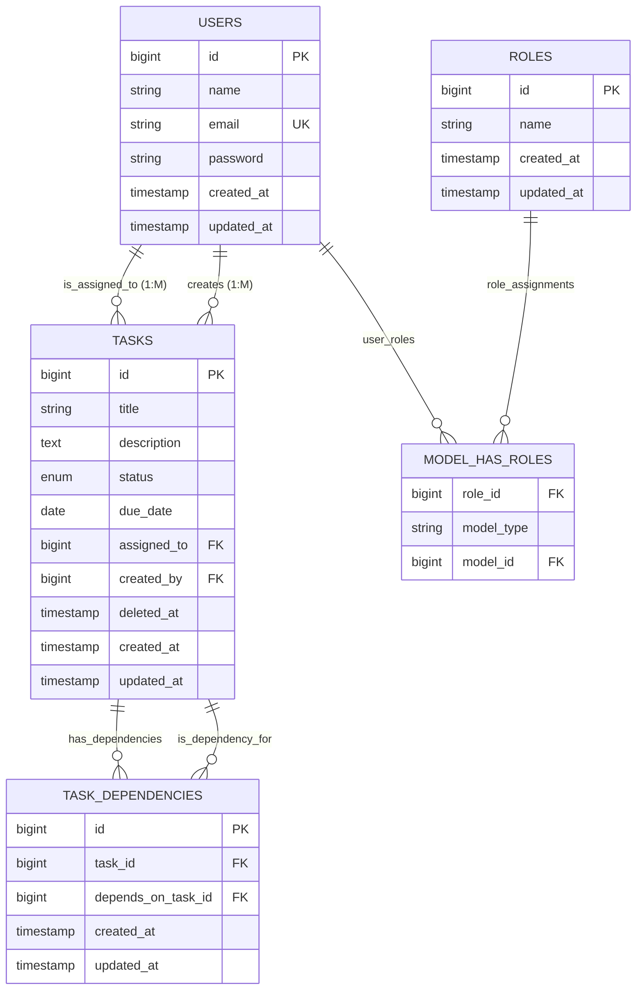

# Task Management System

A comprehensive task management API built with Laravel 11, featuring role-based access control, task dependencies, and soft deletes.

## Features

- **User Authentication** with Laravel Sanctum
- **Role-Based Access Control** (Managers and Users)
- **Task Management** with CRUD operations
- **Task Dependencies** (tasks can depend on other tasks)
- **Soft Deletes** for tasks
- **API Filtering** by status, due date, and assigned user
- **Business Logic** enforcement (dependency completion rules)

## Tech Stack

- **Backend**: Laravel 12, PHP 8.4
- **Database**: MySQL 8.0
- **Authentication**: Laravel Sanctum
- **Authorization**: Spatie Laravel Permission
- **Containerization**: Docker with Laravel Sail
- **API Documentation**: RESTful API

## Database Schema



### **Relationship Types:**

1. **USERS → TASKS (assigned_to)**
   - Type: One-to-Many (1:M)
   - One user can be assigned multiple tasks
   - Each task assigned to max one user

2. **USERS → TASKS (created_by)**
   - Type: One-to-Many (1:M)
   - One user can create multiple tasks
   - Each task created by exactly one user

3. **TASKS ↔ TASKS (dependencies)**
   - Type: Many-to-Many Self-Referencing (M:M Unary)
   - Tasks can depend on multiple other tasks
   - Tasks can be dependencies for multiple tasks
   - Uses junction table: TASK_DEPENDENCIES

4. **USERS ↔ ROLES**
   - Type: Many-to-Many Polymorphic (M:M)
   - Users can have multiple roles
   - Roles can be assigned to multiple users
   - Uses junction table: MODEL_HAS_ROLES

### **Key Conceptual Features:**
- **Unary Relationship**: Tasks self-reference for dependencies
- **Polymorphic Relationship**: Flexible role assignment system
- **Junction Tables**: Explicit M:M implementation
- **Business Rules**: Dependency completion constraints


## Prerequisites

- composer
- Docker & Docker Compose
- Git

## Quick Setup

### 1. Clone the Repository
```bash
git clone https://github.com/Ziad-Elganzory/task-manager.git
cd task-manager
```

### 2. Install Dependencies

```bash
composer install
```

### 3. Environment Setup
```bash
# Copy environment file
cp .env.example .env

# Generate application key
./vendor/bin/sail artisan key:generate
```

### 4. Start the Application
```bash
# Start Docker containers
./vendor/bin/sail up -d

# Run database migrations
./vendor/bin/sail artisan migrate

# Seed the database with roles and test users
./vendor/bin/sail artisan db:seed
```

### 5. Access the Application
- **API Base URL**: `http://localhost`
- **phpMyAdmin**: `http://localhost:8080`
- **Database**: Available on port `3306`

## Default Users

After seeding, you can use these test accounts:

### Managers (can create/read/update/delete tasks, assign to users):
- **Email**: `manager@example.com` | **Password**: `password`
- **Email**: `ziad.manager@example.com` | **Password**: `password`


### Users (can view assigned tasks, update status only):
- **Email**: `user@example.com` | **Password**: `password`
- **Email**: `ziad.developer@example.com` | **Password**: `password`

## 🔧 API Endpoints

### Authentication
```bash
POST /api/register          # Register new user
POST /api/login             # Login user
POST /api/logout            # Logout user (authenticated)
GET  /api/user              # Get current user (authenticated)
```

### Tasks
```bash
GET    /api/tasks           # List tasks (with filters)
POST   /api/tasks           # Create task (managers only)
GET    /api/tasks/{id}      # Get task details
PUT    /api/tasks/{id}      # Update task
PATCH  /api/tasks/{id}      # Partial update task
DELETE /api/tasks/{id}      # Soft delete task (managers only)
DELETE /api/tasks/{id}/force # Force delete task (managers only)
```

### Task Dependencies
```bash
GET    /api/tasks/{id}/dependencies              # List task dependencies
POST   /api/tasks/{id}/dependencies              # Add dependency
DELETE /api/tasks/{id}/dependencies/{depends_on} # Remove dependency
```
### Query Parameters for Task Filtering
```bash
GET /api/tasks?status=pending
GET /api/tasks?due_date_from=2025-01-01&due_date_to=2025-12-31
GET /api/tasks?assigned_to=1
GET /api/tasks?status=completed&assigned_to=2
```


## API Testing with Postman

A complete **Postman collection** is included in this repository for easy API testing:

**File**: `Task Management API.postman_collection.json`

### Import Instructions:
1. Open Postman
2. Click **Import** button
3. Select **Upload Files** 
4. Choose `Task Management API.postman_collection.json` from the project root
5. Click **Import**

### What's Included:
- **Authentication endpoints** (Register, Login, Logout)
- **Task CRUD operations** with proper authorization tests
- **Task filtering** examples with query parameters
- **Task dependencies** management (Create, List, Delete)
- **Role-based access testing** (Manager vs User permissions)
- **Error handling examples** (404, 403, 422 status codes)
- **Pre-configured test data** and environment variables

### Quick Start with Postman:
1. Import the collection
2. Run the **"Login as Manager"** request first
3. The token will be automatically saved for subsequent requests
4. Test any endpoint in the collection!

### Token Management:
The collection automatically manages authentication tokens:
- **Manager Login**: Stores token in both `auth_token` and `manager_token` variables
- **User Login**: Stores token in both `auth_token` and `user_token` variables  
- **Auto-switching**: Use `{{auth_token}}` in requests - it automatically uses the last login token
- **Role Testing**: Use `{{manager_token}}` or `{{user_token}}` to test specific role permissions

This allows easy switching between Manager and User contexts for testing role-based access control!


## Authentication

1. **Login** to get an API token:
```bash
curl -X POST http://localhost/api/login \
  -H "Content-Type: application/json" \
  -d '{"email": "manager@example.com", "password": "password"}'
```

2. **Use the token** in subsequent requests:
```bash
curl -X GET http://localhost/api/tasks \
  -H "Authorization: Bearer YOUR_TOKEN_HERE"
```

## Development Commands

```bash

# Reset database with fresh data
./vendor/bin/sail artisan migrate:fresh --seed

# Stop containers
./vendor/bin/sail down
```

## Project Structure

```
app/
├── Http/Controllers/     # API Controllers
├── Models/              # Eloquent Models
├── Policies/            # Authorization Policies
├── Repositories/        # Data Access Layer
├── Services/           # Business Logic Layer
└── Http/Requests/      # Form Request Validation

database/
├── migrations/         # Database Migrations
└── seeders/           # Database Seeders

routes/
└── api.php            # API Routes
```


### Reset Everything:
```bash
./vendor/bin/sail down -v
./vendor/bin/sail up -d
./vendor/bin/sail artisan migrate:fresh --seed
```

